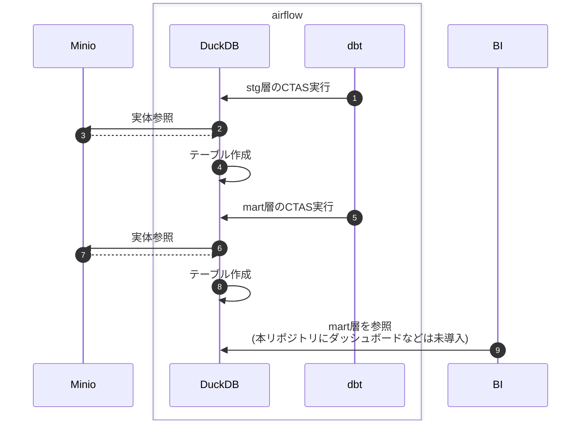

# dbt-duckdb-sample

DuckDBとdbtとAirflowを組み合わせた際の雰囲気を掴んでみたくてHello Worldしてみたリポジトリとなります。

## 使い方

1. コンテナを上げる

    ```sh
    docker compose up -d
    ```

2. `http://localhost:8080`にアクセスする
    ※ID/PASSWORDの初期値は`docker-compose.yaml`を変更していなければ`minio`/`minio123`

3. `run_dbt_workflow`を開き、右上あたりの`▶️`(Trigger DAG)で実行
    ※`target_date`パラメータを入力するように求められるが、初期値で入ってる`2018-01-01`のままでOK
4. `select_tables`タスクのlogタブを確認するとmartをselectした結果が出力されている

## データの流れ



## 参考

- [jaffle_shop_duckdb](https://github.com/dbt-labs/jaffle_shop_duckdb/tree/duckdb): サンプルデータの拝借とSQLを参考にした
- [airflow-dbt](https://github.com/gocardless/airflow-dbt): Airflowからdbtを実行するために導入
- [dbt-duckdb](https://github.com/duckdb/dbt-duckdb): dbtからDuckDBに接続するために導入
- [dbt-osmosis](https://github.com/z3z1ma/dbt-osmosis): メタデータ生成の補助として導入 TODO: `dbt test`や`dbt docs generate`の実装
